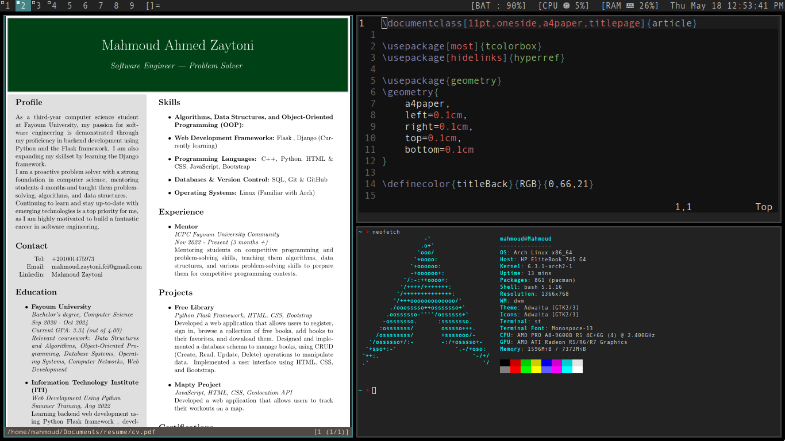

# My build of dwm

If you're new to dwm, please refer to their official [website](https://dwm.suckless.org).

## Screenshot



## Installation

```sh
git clone https://github.com/paniash/dwm
cd dwm
sudo make clean install
```

## Patches

- notitle - removes title of windows from statusbar in dwm
- cfacts - provides the ability to assign different weights to clients in their respective stack in tiled layout.
- uselessgap - adds an adjustable gap between tiled windows providing a visual separation and customization option for window layout.
